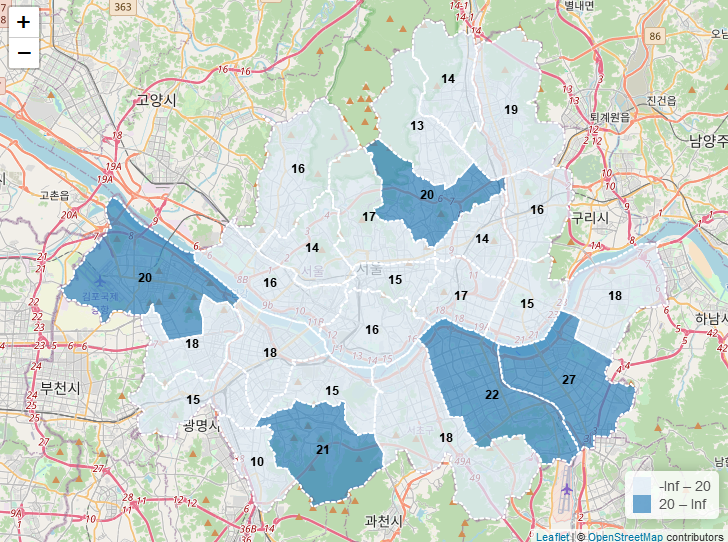

<!-- README.md is generated from README.Rmd. Please edit that file -->

```{r, include = FALSE}
knitr::opts_chunk$set(
  collapse = TRUE,
  comment = "#>",
  fig.path = "man/figures/README-",
  out.width = "100%"
)
```

# valuemap

<!-- badges: start -->
<!-- badges: end -->

The goal of valuemap is to save data analysts' efforts & time with pre-setting sf polygon visualization.

## Installation

You can install the released version of valuemap from [GitHub](https://github.com/) with:

``` r
# install.packages("devtools")
devtools::install_github("Curycu/valuemap")
```
## How to Use?

**Your sf data must have two columns named as `name` & `value`**  
  - `name` column is used for mouse over popup information  
  - `value` column is used for mouse over popup information & color polygons & display center number of polygons  
  
```{r}
library(valuemap)

seoul
```

#### Example 1
##### Quick & easy visualization of sf polygons with value  
```
valuemap(seoul)
```


#### Example 2
##### Emphasize greater or equal to 20 polygons (>= 20, < 20 : two level only)  
```
valuemap(seoul, legend.cut=c(20))
```


#### Example 3
##### Visualize without center number on polygons  
```
valuemap(seoul, legend.cut=c(15,17,20), show.text=FALSE)
```


#### Example 4
##### Change color palette & center number on polygons text color & change background map  
```
valuemap(seoul, map=leaflet::providers$Stamen.Toner, palette='YlOrRd', text.color='blue')
```

 
