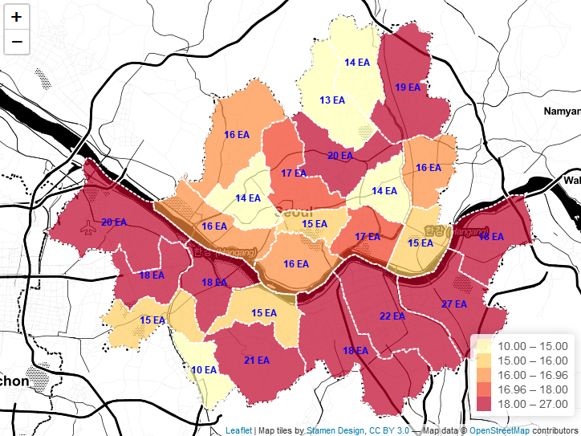

<!-- README.md is generated from README.Rmd. Please edit that file -->

```{r, include = FALSE}
knitr::opts_chunk$set(
  collapse = TRUE,
  comment = "#>",
  fig.path = "man/figures/README-",
  out.width = "100%"
)
```

# valuemap

<!-- badges: start -->
[](https://cran.r-project.org/package=valuemap)
[](https://www.r-pkg.org/pkg/valuemap)
<!-- badges: end -->

The goal of valuemap is to save data analysts' efforts & time with pre-set sf polygon visualization.  
You can also visualize with plain data.frame based on H3 addresses  

## Installation

You can install the released version of valuemap from [GitHub](https://github.com/) with:

```{r, eval = FALSE}
if(!require('devtools')) install.packages('devtools')
devtools::install_github("Curycu/valuemap")
```
## How to Use?

**Your data must have two columns named as `name` & `value`**  
  - `name` column is used for mouse over popup information  
  - `value` column is used for mouse over popup information & color polygons & display center number of polygons  
  
```{r}
library(valuemap)

data('seoul')
seoul
```

#### Example 1
##### Quick & easy visualization of sf polygons with value  
```{r, eval = FALSE}
valuemap(seoul)
```


#### Example 2
##### Emphasize greater or equal to 20 polygons (>= 20, < 20 : two level only)  
```{r, eval = FALSE}
valuemap(seoul, legend.cut=c(20))
```


#### Example 3
##### Visualize without center number on polygons  
```{r, eval = FALSE}
valuemap(seoul, legend.cut=c(15,17,20), show.text=FALSE)
```


#### Example 4
##### Change color palette & center number on polygons text color, format & change background map  
```{r, eval = FALSE}
valuemap(
  seoul, map=leaflet::providers$Stamen.Toner, palette='YlOrRd',
  text.color='blue', text.format=function(x) paste(x,'EA')
)
```

 
#### Example 5
##### You can visualize based on plain data.frame with h3 address 
```{r}
data('seoul_h3')
seoul_h3
```
```{r, eval = FALSE}
valuemap_h3(seoul_h3, legend.cut=1:6, show.text=FALSE)
```

