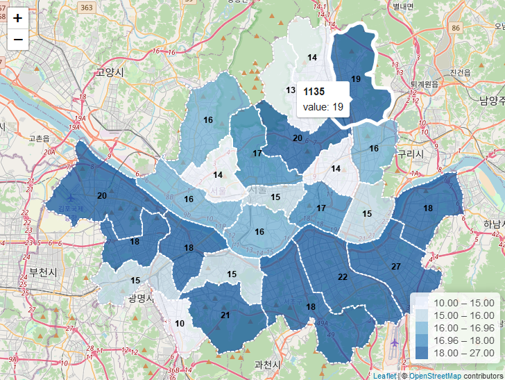
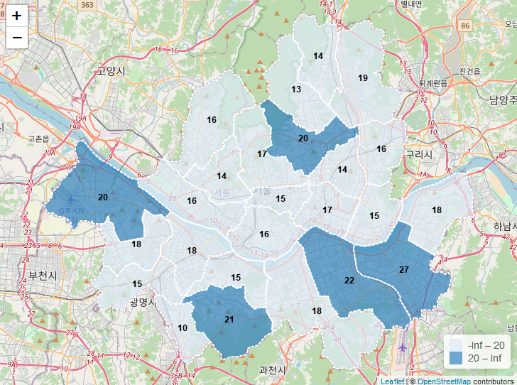
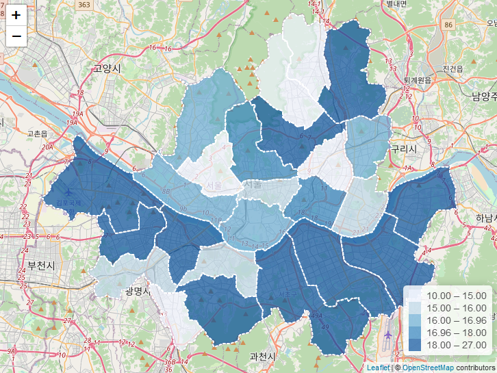
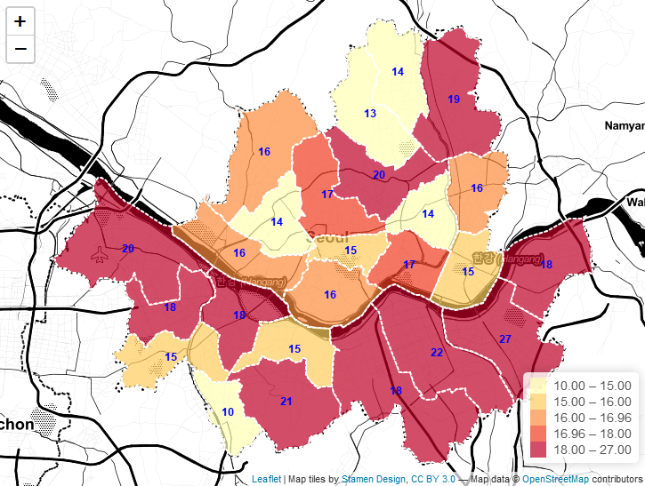
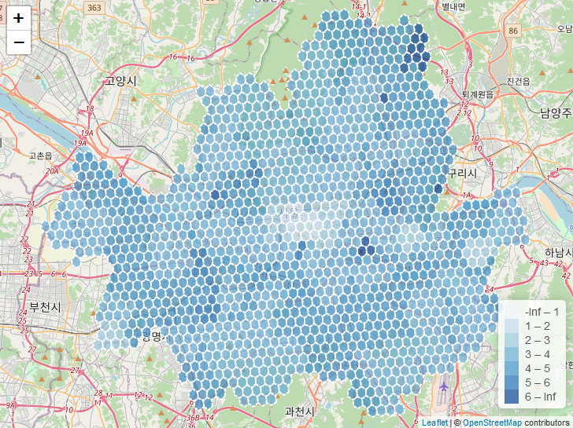
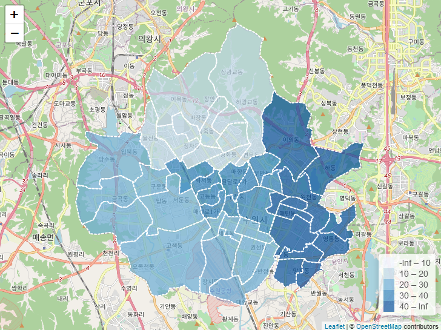

<!-- README.md is generated from README.Rmd. Please edit that file -->

# valuemap

<!-- badges: start -->

<!-- badges: end -->

The goal of valuemap is to save data analysts’ efforts & time with
pre-set sf polygon visualization.

You can also visualize with plain data.frame based on…  
\- H3 addresses  
\- Republic of Korea administrative area code (digit 7, digit 10)

## Installation

You can install the released version of valuemap from
[GitHub](https://github.com/) with:

``` r
if (!require('devtools')) install.packages('devtools')
devtools::install_github("Curycu/valuemap")
```

## How to Use?

**Your data must have two columns named as `name` & `value`**  
\- `name` column is used for mouse over popup information  
\- `value` column is used for mouse over popup information & color
polygons & display center number of polygons

``` r
library(valuemap)

data('seoul')
seoul
#> Simple feature collection with 25 features and 2 fields
#> geometry type:  POLYGON
#> dimension:      XY
#> bbox:           xmin: 126.7643 ymin: 37.42901 xmax: 127.1836 ymax: 37.70108
#> CRS:            EPSG:4326
#> # A tibble: 25 x 3
#>    name  value                                                     geometry
#>    <chr> <int>                                                <POLYGON [m]>
#>  1 1111     17 ((126.969 37.56819, 126.968 37.56718, 126.9679 37.5671, 126…
#>  2 1114     15 ((127.0163 37.55301, 127.0132 37.54994, 127.0117 37.54851, …
#>  3 1117     16 ((126.9825 37.51351, 126.9801 37.51212, 126.9756 37.5123, 1…
#>  4 1120     17 ((127.0628 37.54019, 127.0566 37.5291, 127.0491 37.53255, 1…
#>  5 1121     15 ((127.0923 37.52679, 127.0904 37.526, 127.0885 37.52549, 12…
#>  6 1123     14 ((127.0786 37.57186, 127.0782 37.57094, 127.0778 37.57008, …
#>  7 1126     16 ((127.0958 37.5711, 127.0957 37.5711, 127.0955 37.57105, 12…
#>  8 1129     20 ((127.0245 37.5792, 127.0232 37.57804, 127.0225 37.5781, 12…
#>  9 1130     13 ((127.022 37.61229, 127.0207 37.6125, 127.0206 37.61252, 12…
#> 10 1132     14 ((127.0464 37.63916, 127.0455 37.63783, 127.0453 37.63749, …
#> # … with 15 more rows
```

#### Example 1

##### Quick & easy visualization of sf polygons with value

    valuemap(seoul)



#### Example 2

##### Emphasize greater or equal to 20 polygons (\>= 20, \< 20 : two level only)

    valuemap(seoul, legend.cut=c(20))



#### Example 3

##### Visualize without center number on polygons

    valuemap(seoul, legend.cut=c(15,17,20), show.text=FALSE)



#### Example 4

##### Change color palette & center number on polygons text color, format & change background map

    valuemap(
      seoul, map=leaflet::providers$Stamen.Toner, palette='YlOrRd',
      text.color='blue', text.format=function(x) paste(x,'EA')
    )



#### Example 5

##### You can visualize based on plain data.frame with h3 addresses

``` r
data('seoul_h3')
seoul_h3
#> # A tibble: 1,329 x 2
#>    name            value
#>    <chr>           <dbl>
#>  1 8830e03449fffff     4
#>  2 8830e03453fffff     3
#>  3 8830e0345bfffff     3
#>  4 8830e034c9fffff     3
#>  5 8830e03601fffff     4
#>  6 8830e03603fffff     4
#>  7 8830e03605fffff     4
#>  8 8830e03607fffff     4
#>  9 8830e03609fffff     3
#> 10 8830e0360bfffff     4
#> # … with 1,319 more rows
```

    seoul_h3 %>%
      h3_valuemap(legend.cut=1:6, show.text=FALSE)



#### Example 6

##### You can visualize based on plain data.frame with Korea administrative area id codes

##### (digit 7 or 10 both type available)

``` r
data('suwon')
suwon
#>       name value
#> 1  3101154  15.4
#> 2  3101155  15.5
#> 3  3101156  15.6
#> 4  3101157  15.7
#> 5  3101158  15.8
#> 6  3101159  15.9
#> 7  3101160  16.0
#> 8  3101161  16.1
#> 9  3101162  16.2
#> 10 3101163  16.3
#> 11 3101252  25.2
#> 12 3101253  25.3
#> 13 3101254  25.4
#> 14 3101255  25.5
#> 15 3101256  25.6
#> 16 3101257  25.7
#> 17 3101266  26.6
#> 18 3101261  26.1
#> 19 3101262  26.2
#> 20 3101265  26.5
#> 21 3101264  26.4
#> 22 3101353  35.3
#> 23 3101354  35.4
#> 24 3101355  35.5
#> 25 3101356  35.6
#> 26 3101367  36.7
#> 27 3101368  36.8
#> 28 3101369  36.9
#> 29 3101370  37.0
#> 30 3101371  37.1
#> 31 3101372  37.2
#> 32 3101451  45.1
#> 33 3101452  45.2
#> 34 3101453  45.3
#> 35 3101454  45.4
#> 36 3101464  46.4
#> 37 3101465  46.5
#> 38 3101467  46.7
#> 39 3101460  46.0
#> 40 3101462  46.2
#> 41 3101463  46.3
#> 42 3101260  26.0
#> 43 3101466  46.6
#> 44 3101468  46.8
```

    suwon %>%
      korea_valuemap(legend.cut=c(10,20,30,40), show.text=FALSE)



##### you can search code \<-\> district name mapping with ‘korea’ object

  - source : <https://github.com/vuski/admdongkor>

<!-- end list -->

``` r
library(dplyr)
#> Warning: package 'dplyr' was built under R version 3.6.2

data('korea')
korea %>% select(hcode_7, hcode_10, name)
#> Simple feature collection with 3487 features and 3 fields
#> geometry type:  MULTIPOLYGON
#> dimension:      XY
#> bbox:           xmin: 124.6097 ymin: 33.11187 xmax: 131.8713 ymax: 38.61695
#> z_range:        zmin: 0 zmax: 0
#> m_range:        mmin: 0 mmax: 0
#> CRS:            EPSG:4326
#> First 10 features:
#>    hcode_7   hcode_10                              name
#> 1  1101053 1111053000          서울특별시 종로구 사직동
#> 2  1101054 1111054000          서울특별시 종로구 삼청동
#> 3  1101055 1111055000          서울특별시 종로구 부암동
#> 4  1101056 1111056000          서울특별시 종로구 평창동
#> 5  1101057 1111057000          서울특별시 종로구 무악동
#> 6  1101058 1111058000          서울특별시 종로구 교남동
#> 7  1101060 1111060000          서울특별시 종로구 가회동
#> 8  1101061 1111061500 서울특별시 종로구 종로1·2·3·4가동
#> 9  1101063 1111063000     서울특별시 종로구 종로5·6가동
#> 10 1101064 1111064000          서울특별시 종로구 이화동
#>                          geometry
#> 1  MULTIPOLYGON (((126.9769 37...
#> 2  MULTIPOLYGON (((126.9827 37...
#> 3  MULTIPOLYGON (((126.9759 37...
#> 4  MULTIPOLYGON (((126.9751 37...
#> 5  MULTIPOLYGON (((126.9607 37...
#> 6  MULTIPOLYGON (((126.969 37....
#> 7  MULTIPOLYGON (((126.9891 37...
#> 8  MULTIPOLYGON (((126.9965 37...
#> 9  MULTIPOLYGON (((127.0102 37...
#> 10 MULTIPOLYGON (((127.0073 37...
```
